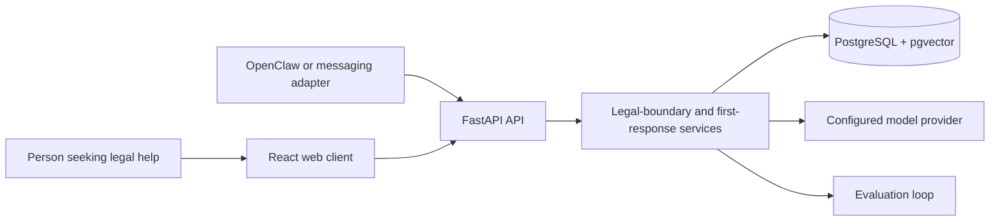

# Architecture

## System context

The web application and any agent/channel adapter share the authenticated API and capability registry. There is no privileged bot-only mutation path. The first-response service owns the staged workflow, while the legal-boundary service constrains claims and escalates situations that require professional or emergency help.

## Trust boundaries

- Browser and channel input is untrusted.
- Authentication and resource ownership are enforced at the API boundary.
- Model output is advisory and must pass deterministic boundary rules.
- Provider credentials, uploaded documents, sessions, and runtime databases remain outside Git.
- Generated evaluation metrics are reproducible output, not source.

## Portable versus local state

Portable product code, migrations, tests, fixtures, agent instructions, and safe templates live in this repository. OpenClaw configuration, credentials, session databases, raw conversations, user memory, and device/channel state remain in the local OpenClaw state directory.
